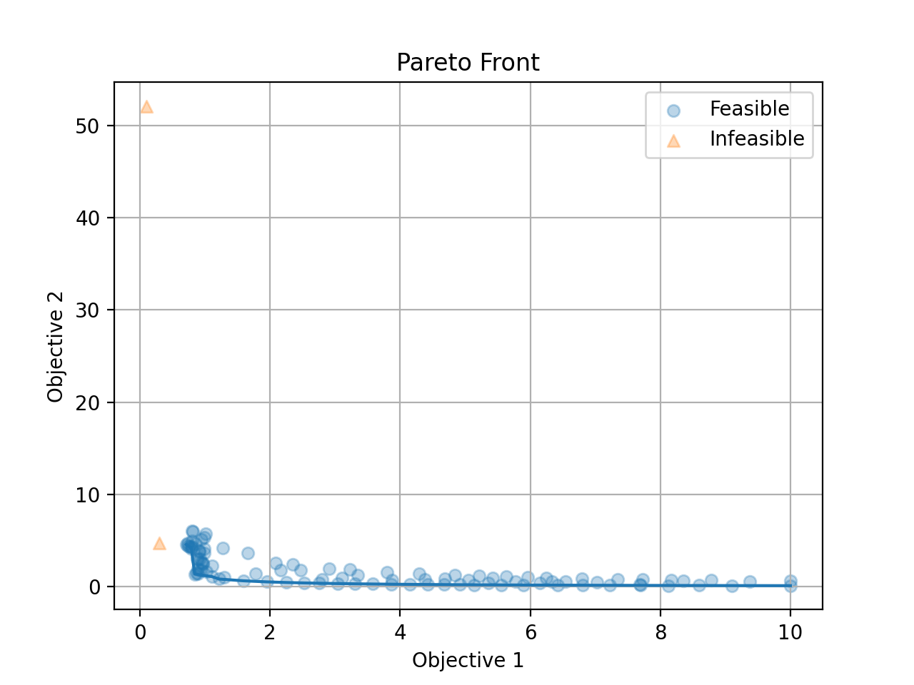
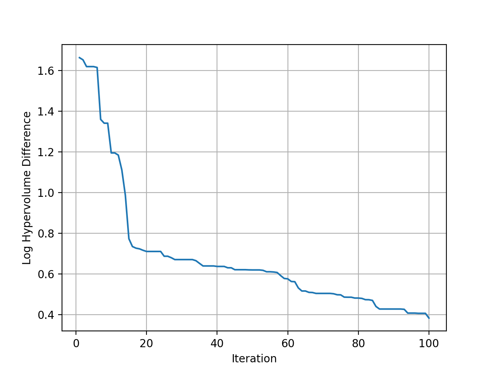
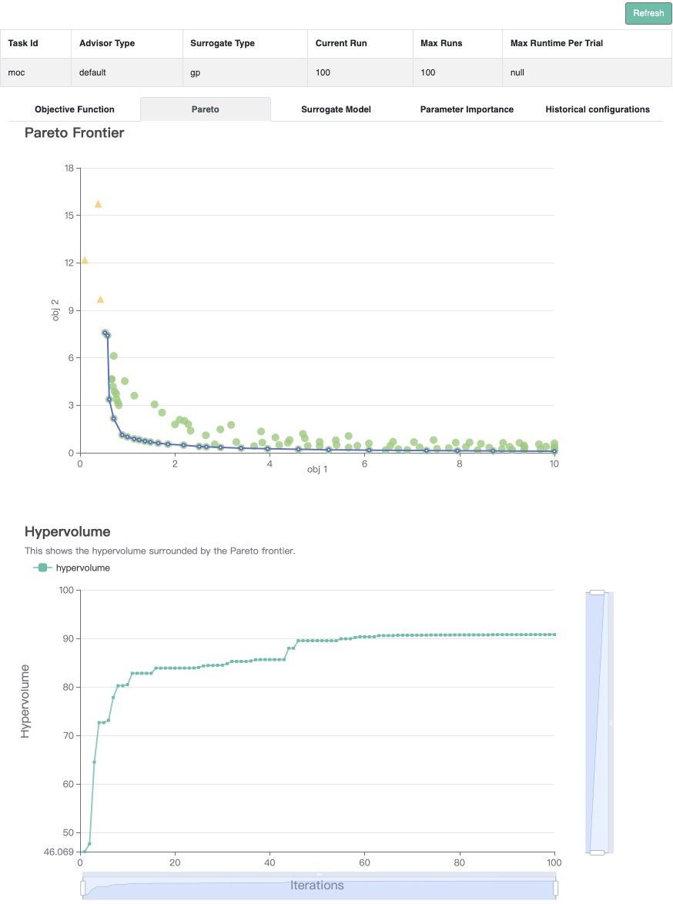

# Multi-Objective with Constraints

In this tutorial, we will introduce how to optimize constrained multiple objectives problem with **OpenBox**.

## Problem Setup

We use constrained multi-objective problem CONSTR in this example. As CONSTR is a built-in function, 
its search space and objective function are wrapped as follows:

```python
from openbox.benchmark.objective_functions.synthetic import CONSTR

prob = CONSTR()
dim = 2
initial_runs = 2 * (dim + 1)
```

```python
import numpy as np
from openbox import space as sp
params = {'x1': (0.1, 10.0),
          'x2': (0.0, 5.0)}
space = sp.Space()
space.add_variables([sp.Real(k, *v) for k, v in params.items()])

def objective_funtion(config: sp.Configuration):
    X = np.array(list(config.get_dictionary().values()))

    result = dict()
    obj1 = X[..., 0]
    obj2 = (1.0 + X[..., 1]) / X[..., 0]
    result['objectives'] = np.stack([obj1, obj2], axis=-1)

    c1 = 6.0 - 9.0 * X[..., 0] - X[..., 1]
    c2 = 1.0 - 9.0 * X[..., 0] + X[..., 1]
    result['constraints'] = np.stack([c1, c2], axis=-1)

    return result
```

After evaluation, the objective function returns a `dict` **(Recommended)**.
The result dictionary should contain:

+ `'objectives'`: A **list/tuple** of **objective values (to be minimized)**. 
In this example, we have only one objective so the tuple contains a single value.

+ `'constraints'`: A **list/tuple** of **constraint values**.
Non-positive constraint values (**"<=0"**) imply feasibility.

## Optimization

```python
from openbox import Optimizer
opt = Optimizer(
    prob.evaluate,
    prob.config_space,
    num_objectives=prob.num_objectives,
    num_constraints=prob.num_constraints,
    max_runs=100,
    surrogate_type='gp',
    acq_type='ehvic',
    acq_optimizer_type='random_scipy',
    initial_runs=initial_runs,
    init_strategy='sobol',
    ref_point=prob.ref_point,
    task_id='moc',
    random_state=1,
    # Have a try on the new HTML visualization feature!
    # visualization='advanced',   # or 'basic'. For 'advanced', run 'pip install "openbox[extra]"' first
    # auto_open_html=True,        # open the visualization page in your browser automatically
)
history = opt.run()
```

Here we create a `Optimizer` instance, and pass the objective function 
and the search space to it. 
The other parameters are:

+ `num_objectives` and `num_constraints` set how many objectives and constraints the objective function will return.
In this example, `num_objectives=2` and `num_constraints=2`.

+ `max_runs=100` means the optimization will take 100 rounds (optimizing the objective function 100 times). 

+ `surrogate_type='gp'`. For mathematical problem, we suggest using Gaussian Process (`'gp'`) as Bayesian surrogate
model. For practical problems such as hyperparameter optimization (HPO), we suggest using Random Forest (`'prf'`).

+ `acq_type='ehvic'`. Use **EHVIC(Expected Hypervolume Improvement with Constraint)**
as Bayesian acquisition function.

+ `acq_optimizer_type='random_scipy'`. For mathematical problems, we suggest using `'random_scipy'` as
acquisition function optimizer. For practical problems such as hyperparameter optimization (HPO), we suggest
using `'local_random'`.

+ `initial_runs` sets how many configurations are suggested by `init_strategy` before the optimization loop.

+ `init_strategy='sobol'` sets the strategy to suggest the initial configurations.

+ `ref_point` specifies the reference point, which is the upper bound on the objectives used for computing
hypervolume. If using EHVI method, a reference point must be provided. In practice, the reference point can be
set 1) using domain knowledge to be slightly worse than the upper bound of objective values, where the upper bound is
the maximum acceptable value of interest for each objective, or 2) using a dynamic reference point selection strategy.

+ `task_id` is set to identify the optimization process.

+ `visualization`: `'none'`, `'basic'` or `'advanced'`.
See {ref}`HTML Visualization <visualization/visualization:HTML Visualization>`.

+ `auto_open_html`: whether to open the visualization page in your browser automatically. 
See {ref}`HTML Visualization <visualization/visualization:HTML Visualization>`.

Then, `opt.run()` is called to start the optimization process.

## Visualization

Since we optimize both objectives at the same time, we get a pareto front as the result.
Call `opt.get_history().plot_pareto_front()` to plot the pareto front.
Please note that `plot_pareto_front` only works when the number of objectives is 2 or 3.

```python
import matplotlib.pyplot as plt

history = opt.get_history()
# plot pareto front
if history.num_objectives in [2, 3]:
    history.plot_pareto_front()  # support 2 or 3 objectives
    plt.show()
```



Then plot the hypervolume difference during the optimization compared to the ideal pareto front.

```python
# plot hypervolume (optimal hypervolume of CONSTR is approximated using NSGA-II)
history.plot_hypervolumes(optimal_hypervolume=92.02004226679216, logy=True)
plt.show()
```



<font color=#FF0000>(New Feature!)</font>
Call `history.visualize_html()` to visualize the optimization process in an HTML page.
For `show_importance` and `verify_surrogate`, run `pip install "openbox[extra]"` first.
See {ref}`HTML Visualization <visualization/visualization:HTML Visualization>` for more details.

```python
history.visualize_html(open_html=True, show_importance=True,
                       verify_surrogate=True, optimizer=opt)
```


