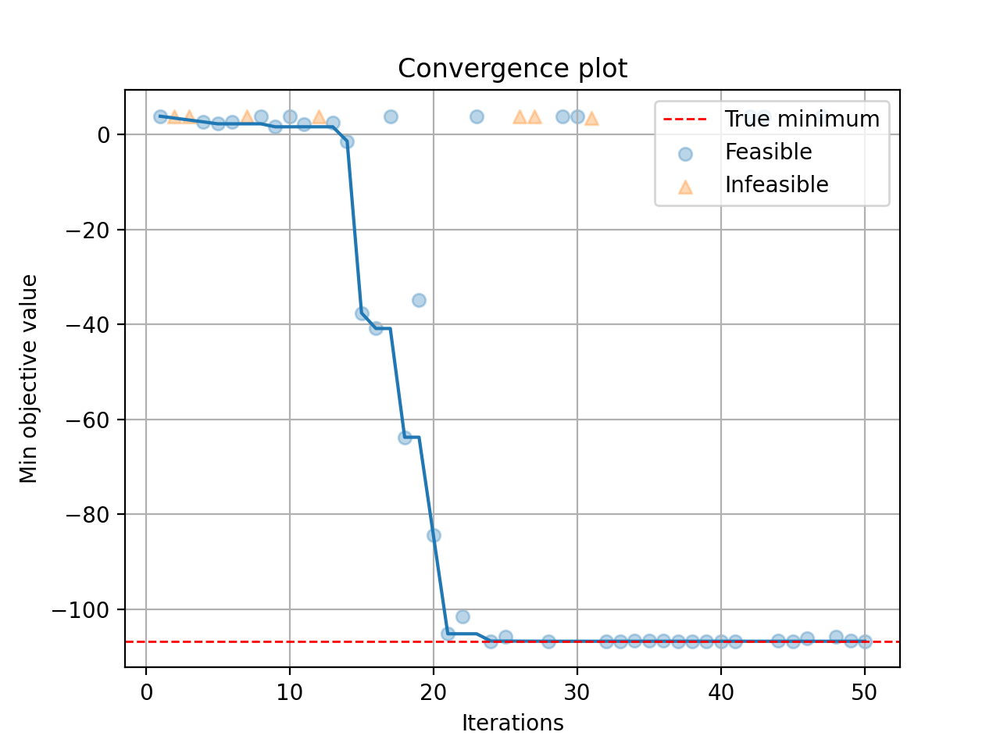
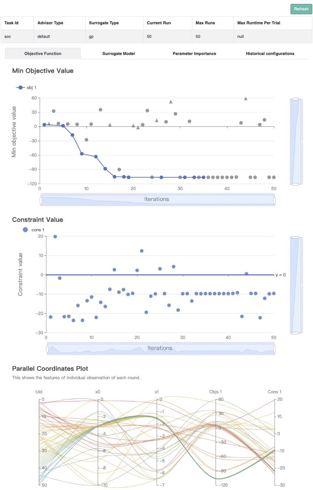

# Single-Objective with Constraints

In this tutorial, we will introduce how to optimize a constrained problem with **OpenBox**.

## Problem Setup

First, **define search space** and **define objective function**
to <font color=#FF0000>**minimize**</font>. Here we use the constrained **Mishra** function.

```python
import numpy as np
from openbox import space as sp

def mishra(config: sp.Configuration):
    X = np.array([config['x%d' % i] for i in range(2)])
    x, y = X[0], X[1]
    t1 = np.sin(y) * np.exp((1 - np.cos(x))**2)
    t2 = np.cos(x) * np.exp((1 - np.sin(y))**2)
    t3 = (x - y)**2

    result = dict()
    result['objectives'] = [t1 + t2 + t3, ]
    result['constraints'] = [np.sum((X + 5)**2) - 25, ]
    return result

params = {
    'float': {
        'x0': (-10, 0, -5),
        'x1': (-6.5, 0, -3.25)
    }
}
space = sp.Space()
space.add_variables([
    sp.Real(name, *para) for name, para in params['float'].items()
])
```

After evaluation, the objective function returns a `dict` **(Recommended)**.
The result dictionary should contain:

+ `'objectives'`: A **list/tuple** of **objective values (to be minimized)**. 
In this example, we have only one objective so the tuple contains a single value.

+ `'constraints'`: A **list/tuple** of **constraint values**.
Non-positive constraint values (**"<=0"**) imply feasibility.

## Optimization

After defining the search space and the objective function, we can run the optimization process as follows:

```python
from openbox import Optimizer

opt = Optimizer(
    mishra,
    space,
    num_constraints=1,
    num_objectives=1,
    surrogate_type='gp',                # try using 'auto'!
    acq_optimizer_type='random_scipy',  # try using 'auto'!
    max_runs=50,
    task_id='soc',
    # Have a try on the new HTML visualization feature!
    # visualization='advanced',   # or 'basic'. For 'advanced', run 'pip install "openbox[extra]"' first
    # auto_open_html=True,        # open the visualization page in your browser automatically
)
history = opt.run()
```

Here we create a `Optimizer` instance, and pass the objective function 
and the search space to it. 
The other parameters are:

+ `num_objectives=1` and `num_constraints=1` indicate that our function returns a single value with one constraint. 

+ `max_runs=50` means the optimization will take 50 rounds (optimizing the objective function 50 times). 

+ `task_id` is set to identify the optimization process.

+ `visualization`: `'none'`, `'basic'` or `'advanced'`.
See {ref}`HTML Visualization <visualization/visualization:HTML Visualization>`.

+ `auto_open_html`: whether to open the visualization page in your browser automatically. 
See {ref}`HTML Visualization <visualization/visualization:HTML Visualization>`.

Then, `opt.run()` is called to start the optimization process.

## Visualization

After the optimization, `opt.run()` returns the optimization history. Or you can call 
`opt.get_history()` to get the history.
Then, call `print(history)` to see the result:

```python
history = opt.get_history()
print(history)
```

```
+-------------------------+---------------------+
| Parameters              | Optimal Value       |
+-------------------------+---------------------+
| x0                      | -3.172421           |
| x1                      | -1.506397           |
+-------------------------+---------------------+
| Optimal Objective Value | -105.72769850551406 |
+-------------------------+---------------------+
| Num Configs             | 50                  |
+-------------------------+---------------------+
```

Call `history.plot_convergence()` to visualize the optimization process:

```python
import matplotlib.pyplot as plt
history.plot_convergence(true_minimum=-106.7645367)
plt.show()
```



<font color=#FF0000>(New Feature!)</font>
Call `history.visualize_html()` to visualize the optimization process in an HTML page.
For `show_importance` and `verify_surrogate`, run `pip install "openbox[extra]"` first.
See {ref}`HTML Visualization <visualization/visualization:HTML Visualization>` for more details.

```python
history.visualize_html(open_html=True, show_importance=True,
                       verify_surrogate=True, optimizer=opt)
```


