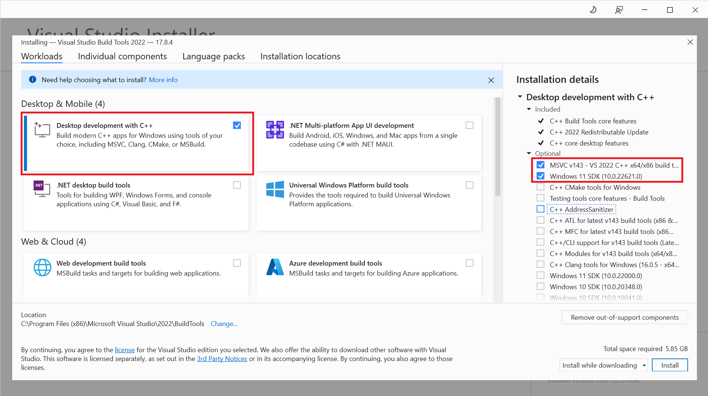

# Install Microsoft Visual C++ Dependencies

For Windows users who have trouble building wheel for some packages, e.g. ConfigSpace or pyrfr, 
the error message is like 'ERROR: Failed building wheel for XXX' or 'Microsoft Visual C++ 14.0 is required',
this document will help you to install Microsoft Visual C++ dependencies on Windows.

## 1. Upgrade setuptools

First, please upgrade setuptools to the latest version:

```bash
pip install --upgrade setuptools
```

## 2. Download and Install Microsoft Visual C++ Build Tools

Visit the official website of Visual Studio and select **Download**: <https://visualstudio.microsoft.com/downloads/>

Scroll down to the bottom of the page, find the **Tools for Visual Studio** section, and 
download **Build Tools for Visual Studio**.

After downloading, run the installer, select **Desktop development with C++**, 
and check **at least the first two options** in the right panel:



Then click **Install** to start the installation.

## 3. Reinstall the Package

After installing the Microsoft Visual C++ dependencies, you can reinstall the package that failed to build wheel.

For example, if you want to install pyrfr, run the following command:

```bash
pip install pyrfr
```

-----
Reference: <https://zhuanlan.zhihu.com/p/165008313>
