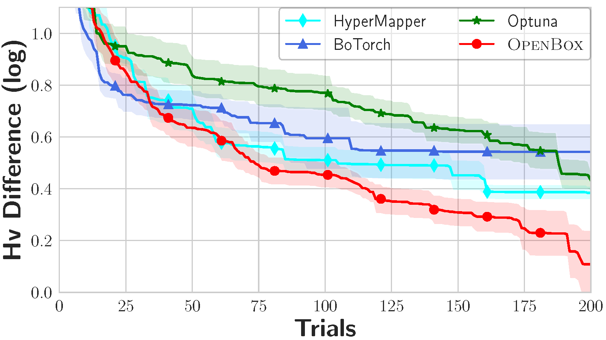
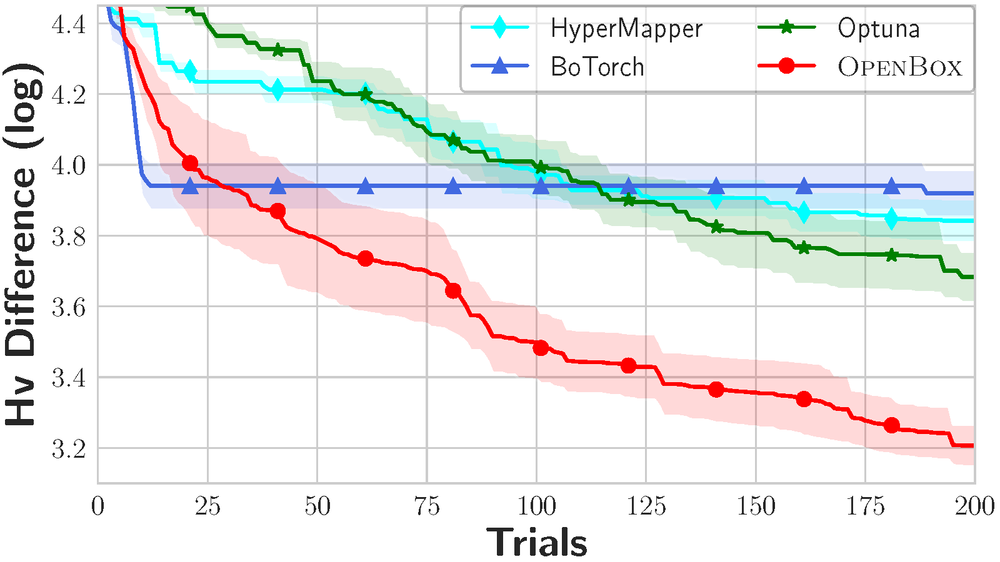
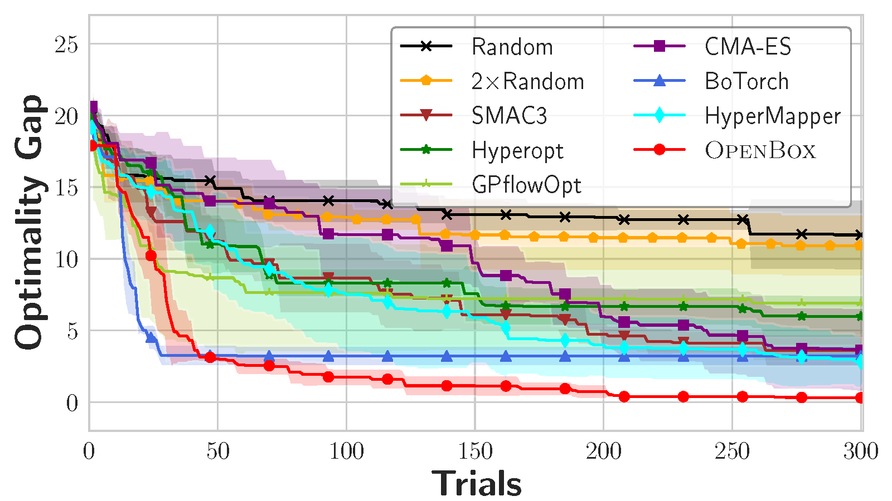
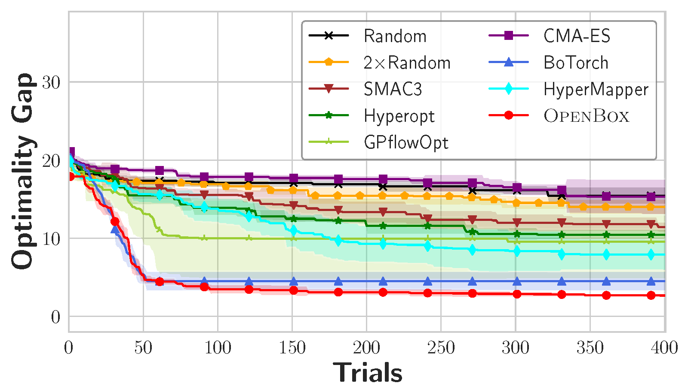
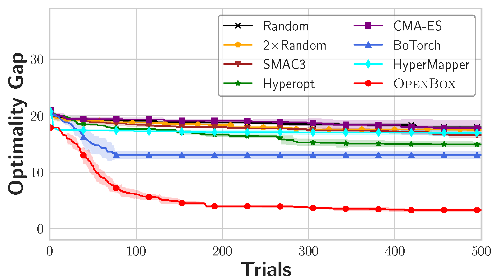
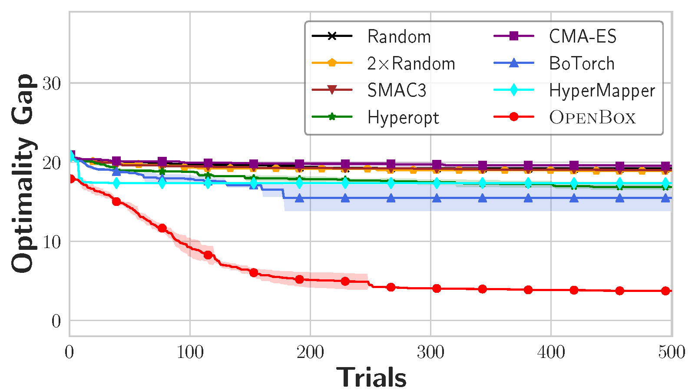
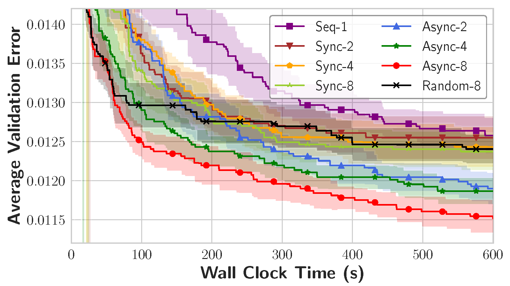

# Comparison with other tools

This document compares OpenBox with other popular black-box optimization (BBO) systems.

## Capabilities

| System/Package | FIOC | Multi-obj. | Constraint | History | Distributed | Parallel | Visualization | Algorithm Selection | Ask-and-Tell |
|----------------|------|------------|------------|---------|-------------|----------|---------------|---------------------|--------------|
| Hyperopt       | √    | ×          | ×          | ×       | √           | √        | ×             | √                   | √            |
| Spearmint      | ×    | ×          | √          | ×       | ×           | √        | ×             | √                   | ×            |
| SMAC3          | √    | √          | ×          | ×       | ×           | √        | △             | ×                   | √            |
| BoTorch        | ×    | √          | √          | ×       | ×           | √        | △             | ×                   | ×            |
| Ax             | √    | √          | √          | ×       | √           | √        | √             | √                   | ×            |
| Optuna         | √    | √          | √          | ×       | √           | √        | √             | ×                   | √            |
| GPflowOPT      | ×    | √          | √          | ×       | ×           | ×        | ×             | ×                   | ×            |
| HyperMapper    | √    | √          | √          | ×       | ×           | ×        | ×             | ×                   | ×            |
| HpBandSter     | √    | ×          | ×          | ×       | √           | √        | √             | ×                   | ×            |
| Syne Tune      | √    | √          | √          | √       | √           | √        | √             | ×                   | ×            |
| Vizier         | √    | ×          | △          | △       | √           | √        | ×             | ×                   | ×            |
| **OpenBox**    | √    | √          | √          | √       | √           | √        | √             | √                   | √            |

+ **FIOC**: Support different input variable types, including Float, Integer, Ordinal and Categorical.
+ **Multi-obj.**: Support optimizing multiple objectives.
+ **Constraint**: Support inequality constraints.
+ **History**: Support injecting prior knowledge from previous tasks into the current search (i.e. transfer learning).
+ **Distributed**: Support parallel evaluations in a distributed environment.
+ **Parallel**: Support parallel evaluations on a single machine.
+ **Visualization**: Support visualizing the optimization process.
+ **Algorithm Selection**: Support automatic algorithm selection.
+ **Ask-and-Tell**: Support the ask-and-tell interface.
+ △ means the system cannot support it for general cases or requires additional dependencies.

## Performance

**Experiment setup:**
+ **Algorithm selection:** The algorithm used in OpenBox is selected via automatic algorithm selection mechanism.
  For other systems, the algorithm is selected according to the documentation or the default algorithm is used.
+ Each experiment is repeated 10 times. The mean and standard deviation are computed for visualization.

### Constrained Multi-objective Problems

|                                                                                |                                                                             |  
|:------------------------------------------------------------------------------:|:---------------------------------------------------------------------------:|  
|  |  |  
|                                   (a) CONSTR                                   |                                   (b) SRN                                   |

Figure 1: Constrained multi-objective problems.

**Setup:**
+ **Problems:** synthetic functions CONSTR (2 objectives, 2 constraints) and SRN (2 objectives, 2 constraints).
+ **Budget:** 200 iterations.
+ **Metrics:** Hypervolume difference is the difference between the hypervolume of the ideal Pareto front
  and that of the estimated Pareto front by a given algorithm.
+ **Algorithm in OpenBox:** Gaussian Process with Expected Hypervolume Improvement (auto-selected).

We benchmark the performance of OpenBox on constrained multi-objective problems CONSTR and SRN.
As shown in Figure 1, OpenBox outperforms the other baselines on the constrained multi-objective problems 
in terms of convergence speed and stability.

### LightGBM tuning task

Figure 2: LightGBM tuning task.

**Setup:**
+ **Problem:** tuning LightGBM on 25 OpenML datasets.
+ **Budget:** 50 iterations each.
+ **Metrics:** Performance rank of the best achieved accuracy among all baselines on each dataset.
+ **Algorithm in OpenBox:** Gaussian Process with Expected Improvement (auto-selected).
+ **24 datasets with OpenML id:**
abalone (183), ailerons (734), analcatdata_supreme (728), bank32nh (833), cpu_act (761), delta_ailerons (803), delta_elevators (819), kc1 (1067), kin8nm (807), mammography (310), mc1 (1056), optdigits (28), pendigits (32), phoneme (1489), pollen (871), puma32H (752), puma8NH (816), quake (772), satimage (182), segment (36), sick (38), space_ga (737), spambase (44), wind (847).

We benchmark the performance of OpenBox on a LightGBM tuning task.
Figure 2 shows the box plot of the performance rank of each baseline.
The performance rank is the rank of the best achieved accuracy on each dataset.
We observe that OpenBox outperforms the other competitive systems, achieves a
median rank of 1.25 and ranks the first in 12 out of 24 datasets.

### Scalability Experiment

|                                                                                       |                                                                                       |  
|:-------------------------------------------------------------------------------------:|:-------------------------------------------------------------------------------------:|  
|   |   |  
|                                     (a) 4d-Ackley                                     |                                     (b) 8d-Ackley                                     |
|  |  |  
|                                    (c\) 16d-Ackley                                    |                                    (d) 32d-Ackley                                     |

Figure 3. Scalability of the input dimensions on Ackley.

**Setup:**
+ **Problem:** synthetic function Ackley with different input dimensions (4, 8, 16 and 32).
+ **Budget:** 300 to 500 iterations depend on the problem difficulty.
+ **Metrics:** Optimal gap is the gap between the best found value and the optimal value. 
+ **Algorithm in OpenBox:** Gaussian Process with Expected Improvement (auto-selected).

To demonstrate the scalability of OpenBox, we conduct experiments on the 
synthetic function Ackley with different input dimensions.
Figure 3 shows the optimal gap of each baseline with the growth of input dimensions.
We observe that OpenBox is the only system that achieves consistent and excellent results
when the dimensions of the hyperparameter space grow larger. 
When solving Ackley with 16 and 32-dimensional inputs, OpenBox achieves 
more than 10× speedups over the other baselines.

### Parallel Experiment

Figure 4: Parallel LightGBM tuning task on optdigits.

**Setup:**
+ **Problem:** tuning LightGBM on optdigits in parallel.
+ **Budget:** 600 seconds.
+ **Metrics:** Average validation error.
+ **Algorithm in OpenBox:** Gaussian Process with Expected Improvement.
  For parallel tuning, median imputation algorithm is used (auto-selected).

We conduct an experiment to tune the hyper-parameters of LightGBM in parallel on optdigits with a budget of 600 seconds.
Figure 4 shows the average validation error with different parallel modes and the number of workers.
The asynchronous mode of OpenBox with 8 workers achieves the best results and outperforms Random Search with
8 workers by a wide margin. It brings a speedup of 8× over the sequential mode, which is close to the ideal speedup.
