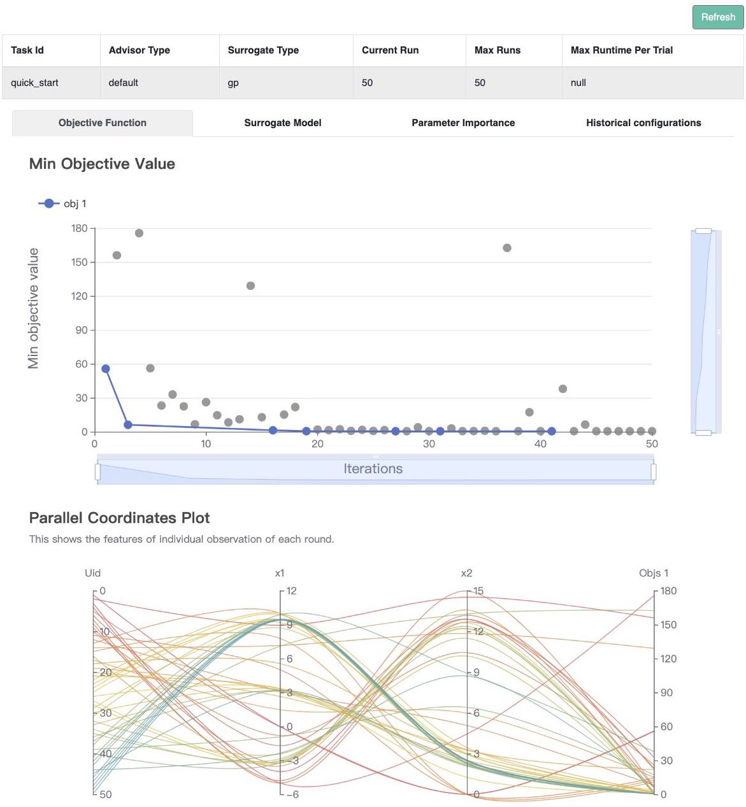

# Quick Start

This tutorial helps you run your first example with **OpenBox**.

## Space Definition

First, define a search space.

```python
from openbox import space as sp

# Define Search Space
space = sp.Space()
x1 = sp.Real("x1", -5, 10, default_value=0)
x2 = sp.Real("x2", 0, 15, default_value=0)
space.add_variables([x1, x2])
```

In this example, we create an empty search space, and then add two real (floating-point) variables into it.
The first variable `x1` ranges from -5 to 10, and the second one `x2` ranges from 0 to 15.

OpenBox also supports other types of variables.
Here are examples of how to define `Int` and `Categorical` variables:

```python
from openbox import space as sp

i = sp.Int("i", 0, 100) 
kernel = sp.Categorical("kernel", ["rbf", "poly", "sigmoid"], default_value="rbf")
```

For advanced usage, please refer to {ref}`Problem Definition with Complex Search Space <advanced_usage/complex_space:Problem Definition with Complex Search Space>`.

The **space** in **OpenBox** is implemented based on **ConfigSpace** package.
For more usage, also refer to [ConfigSpace’s documentation](https://automl.github.io/ConfigSpace/master/index.html).

## Objective Definition

Second, define the objective function to be optimized.
Note that **OpenBox** aims to <font color=#FF0000>**minimize**</font> the objective function.
Here we provide an example of the **Branin** function.

```python
import numpy as np

# Define Objective Function
def branin(config):
    x1, x2 = config['x1'], config['x2']
    y = (x2-5.1/(4*np.pi**2)*x1**2+5/np.pi*x1-6)**2+10*(1-1/(8*np.pi))*np.cos(x1)+10
    return {'objectives': [y]}
```

The objective function takes as input a configuration sampled from `space`
and outputs the objective value.

## Optimization

After defining the search space and the objective function, we can run the optimization process 
as follows:

```python
from openbox import Optimizer

# Run
opt = Optimizer(
    branin,
    space,
    max_runs=50,
    surrogate_type='gp',
    task_id='quick_start',
    # Have a try on the new HTML visualization feature!
    # visualization='advanced',   # or 'basic'. For 'advanced', run 'pip install "openbox[extra]"' first
    # auto_open_html=True,        # open the visualization page in your browser automatically
)
history = opt.run()
```

Here we create a `Optimizer` instance, and pass the objective function `branin` and the 
search space `space` to it. The other parameters are:

+ `num_objectives=1` and `num_constraints=0` indicates our branin function returns a single value with no 
constraint. 

+ `max_runs=50` means the optimization will take 50 rounds (optimizing the objective function 50 times). 

+ `surrogate_type='gp'`. For mathematical problems, we suggest using Gaussian Process (`'gp'`) as Bayesian surrogate
model. For practical problems such as hyperparameter optimization (HPO), we suggest using Random Forest (`'prf'`).

+ `task_id` is set to identify the optimization process.

+ `visualization`: `'none'`, `'basic'` or `'advanced'`.
See {ref}`HTML Visualization <visualization/visualization:HTML Visualization>`.

+ `auto_open_html`: whether to open the visualization page in your browser automatically. 
See {ref}`HTML Visualization <visualization/visualization:HTML Visualization>`.

Then, `opt.run()` is called to start the optimization process.

## Visualization

After the optimization, `opt.run()` returns the optimization history.
Call `print(history)` to see the result:

```python
print(history)
```

```
+-------------------------+-------------------+
| Parameters              | Optimal Value     |
+-------------------------+-------------------+
| x1                      | -3.138277         |
| x2                      | 12.254526         |
+-------------------------+-------------------+
| Optimal Objective Value | 0.398096578033325 |
+-------------------------+-------------------+
| Num Configs             | 50                |
+-------------------------+-------------------+
```

Call `history.plot_convergence()` to visualize the optimization process:

```python
import matplotlib.pyplot as plt
history.plot_convergence(true_minimum=0.397887)
plt.show()
```


Call `print(history.get_importance())` to print the parameter importance:
(Note that you need to install the `pyrfr` package to use this function.
{ref}`Pyrfr Installation Guide <installation/install_pyrfr:pyrfr installation guide>`

```python
print(history.get_importance())
```

```
+------------+------------+
| Parameters | Importance |
+------------+------------+
| x1         | 0.488244   |
| x2         | 0.327570   |
+------------+------------+
```

<font color=#FF0000>(New Feature!)</font>
Call `history.visualize_html()` to visualize the optimization process in an HTML page.
For `show_importance` and `verify_surrogate`, run `pip install "openbox[extra]"` first.
See {ref}`HTML Visualization <visualization/visualization:HTML Visualization>` for more details.

```python
history.visualize_html(open_html=True, show_importance=True,
                       verify_surrogate=True, optimizer=opt)
```


