# Visualization

In this tutorial, we will explain the visualization of BBO problems in **OpenBox**.

## Open Visualization

First, when creating an Optimizier instance, you can choose to open visualization, and pass the location where to put the html and essential data for visualization.

Here we use the code in [Single-Objective Black-box Optimization](https://open-box.readthedocs.io/en/latest/examples/single_objective_hpo.html) as an example. For how to optimize different problems, please see [**Examples**](https://open-box.readthedocs.io/en/latest/examples/examples.html).

```python
from openbox import Optimizer

# Run
opt = Optimizer(
    objective_function,
    get_configspace(),
    num_objs=1,
    num_constraints=0,
    max_runs=100,
    surrogate_type='prf',
    time_limit_per_trial=180,
    task_id='so_hpo',
)
history = opt.run()
```

The relevant parameters are:

+ **visualization='basic'**
    + Open the visualization with basic functions.
    + other options:
        + **'none'**: Run the task without visualization.
        + **'advanced'**: Open the visualization with advanced functions.
    + For basic functions and advanced functions, please see below.


+ **logging_dir='usr/logs'**
    + Set the **absolute path** where you want the visualization webpage locates. 
    + After the optimization, in path 'logging_dir/history/task_id', you will see an html document named by the task_id and the time you create the task. This is the visualization webpage, and you can open it with a browser.

## Basic Visualization

### 1 Objective Function

#### 1.1 Objective Value Chart

This shows the objective value of every iteration. 

For **constrained problems**, observations that meet the constriant will be shown as circle. Otherwise, triangle.

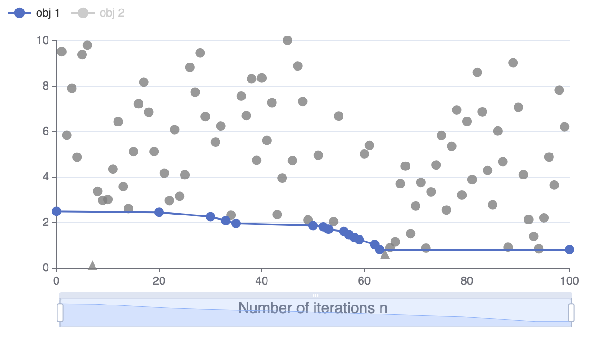

<br>

#### 1.2 Constraint Value Chart

This visualization is only for **constrained problems**.

This shows the constraint value of every iteration. By default, Non-positive constraint values (**”<=0”**) imply feasibility.

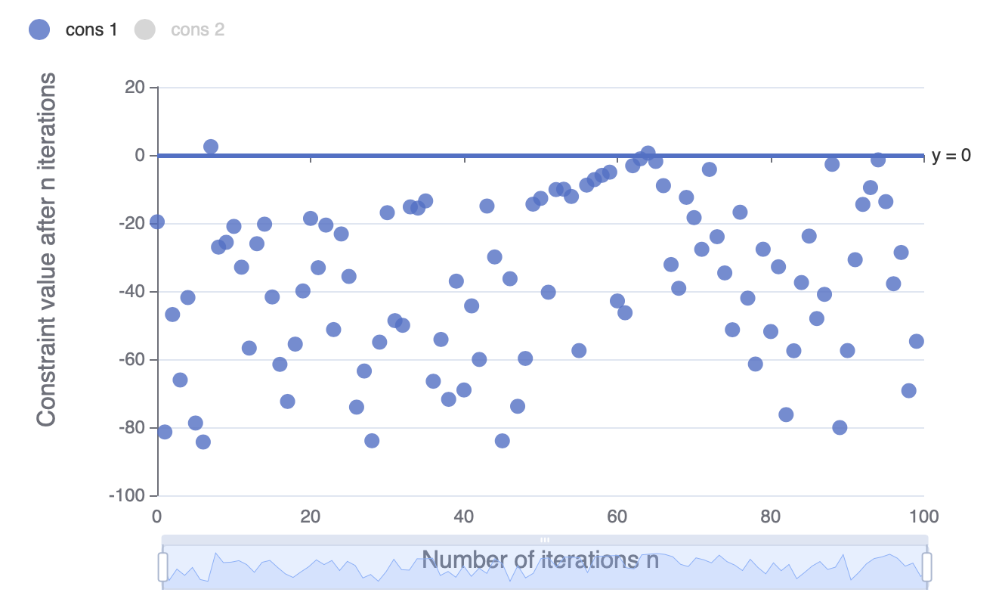

<br>

#### 1.3 Parallel Coordinates Plot

This shows the values of parameters and objective values of individual observation each round.

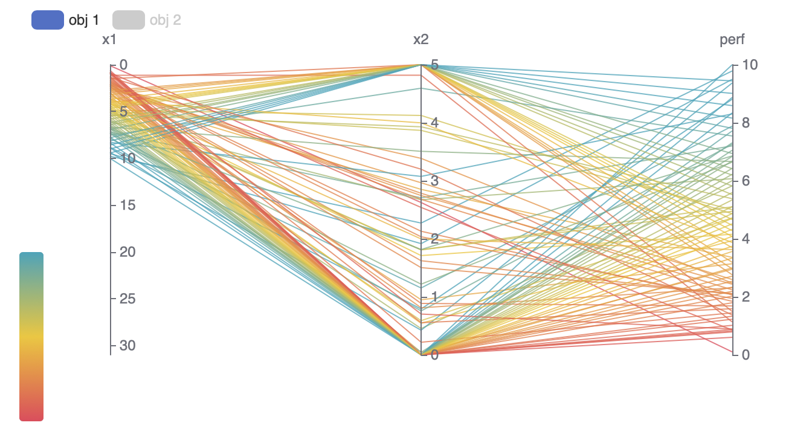

<br>

### 2 Pareto
This part is only available for **muti-objective problems**.

In multi-objective problems, since we don't know which objective is the most important, we find a set of pareto optimal solutions. A pareto optimal solution means that it cannot be improved in any of the objectives without degrading at least one of the other objective. All pareto optimal solutions form a pareto frontier. Our aim is to maximize the hypervolume from a worst solution to the pareto frontier.

#### 2.1 Pareto Frontier

Visualization of pareto frontier is only available for **two or three objectives problems**.

Pareto frontier will be shown as a curve (2-obj) or a surface (3-obj). For **constrained problems**, observations that meet the constriant will be shown as circle. Otherwise, triangle.

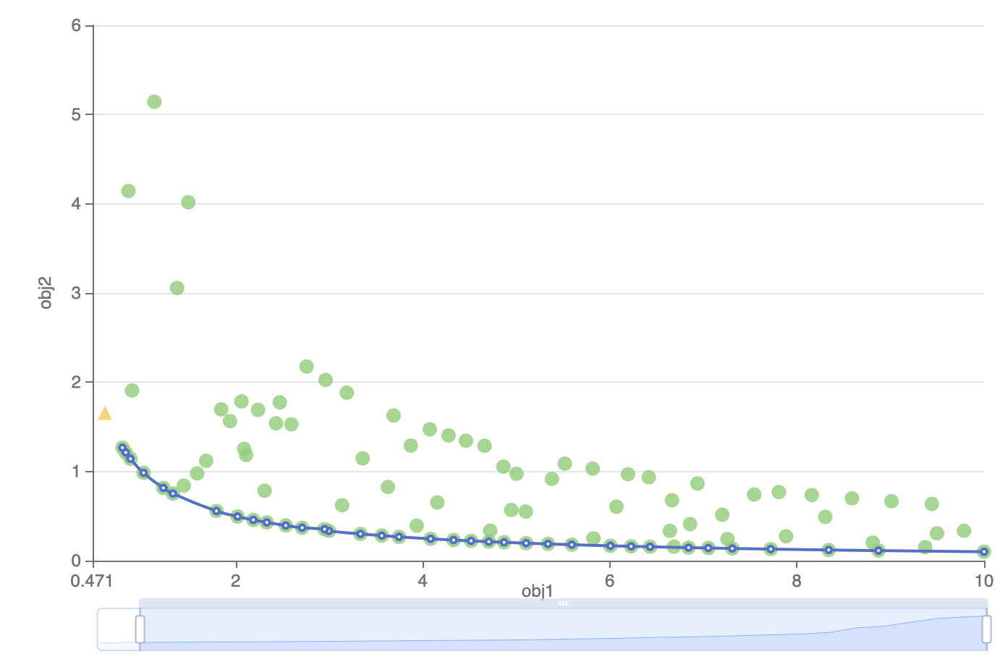

<br>

#### 2.2 Pareto Frontier Hypervolume

This shows the hypervolume surrounded by the pareto frontier in each iteration.


<br>

### 3 Historical Configurations

This table records data of every run of optimization. If the data is too long to show all, you can click the **"..."** beside it to see the whole data.

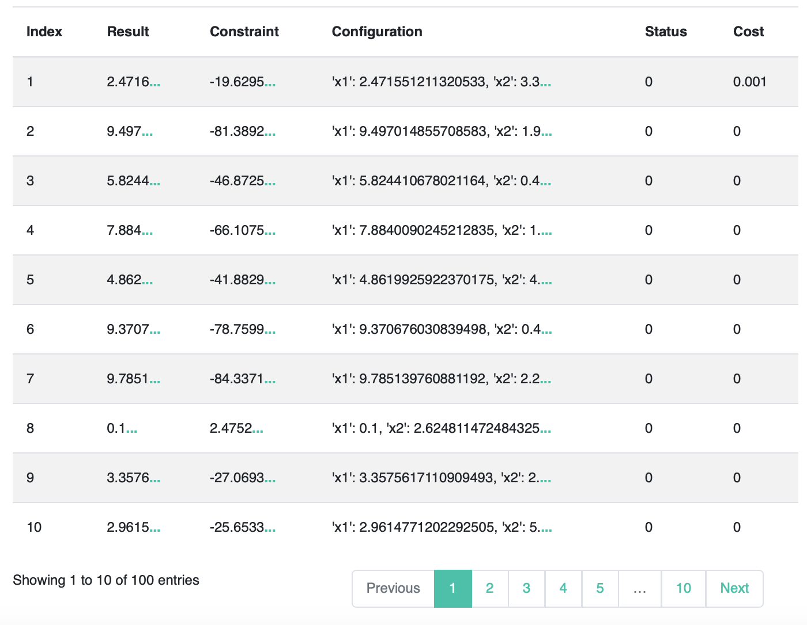

<br>

## Advanced Visualization

### 1 Surrogate Model

A surrogate model is trained to approximate the predictions of a black box model. We visualize surrogate model to see its performance.

#### 1.1 Predicted Objective Value

X-axis is the predicted objective value from surrogate model. Y-axis is the true value. The closer the dot is to the line y=x, the better the prediction of surrogate model is.

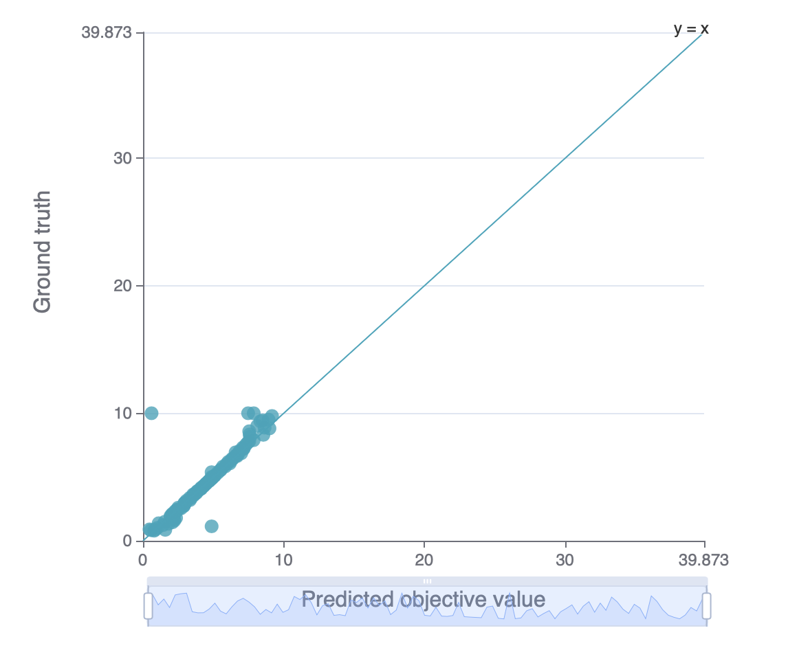

<br>

#### 1.2 Predicted Objective Value Rank

This chart is similar to *Predicted Objective Value*. But here we predict the rank of a few objective value. X-axis is the predicted objective value rank from surrogate model. Y-axis is the true value rank. The closer the dot is to the line y=x, the better the prediction of surrogate model is.

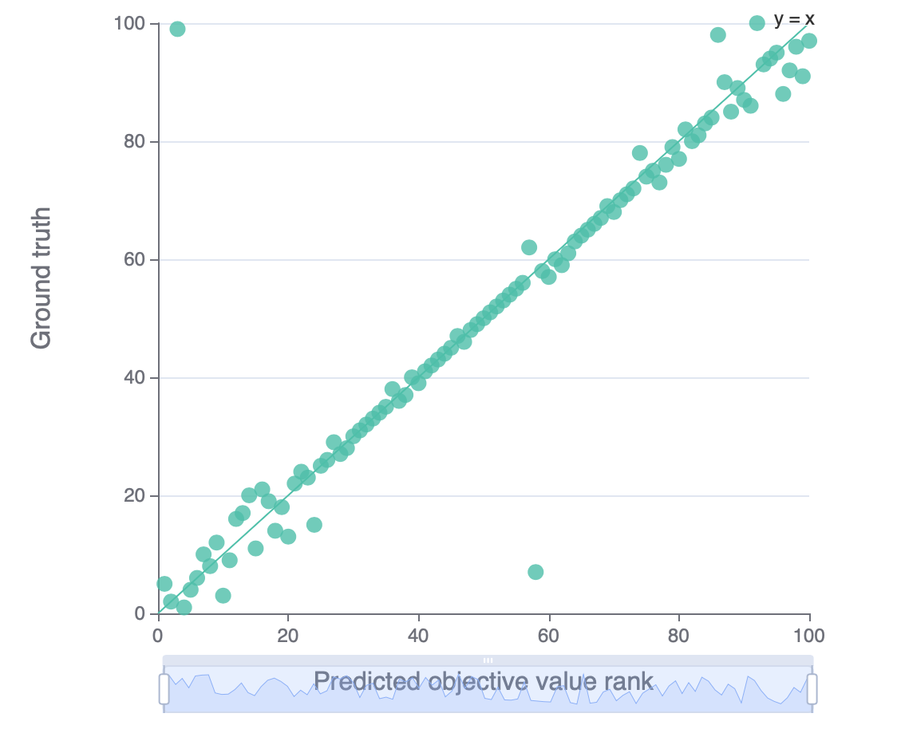

<br>

#### 1.3 Predicted Constraint Value

This chart is only for **constrained problems**.

Besides objective value, we can also use surrogate model to predict constraint value. This chart is similar to *Predicted Objective Value*, except that we predict constraint value here.

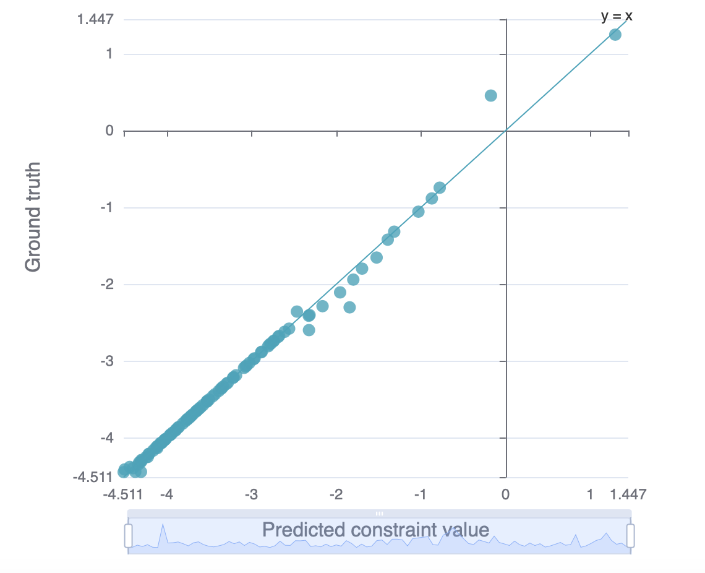

<br>

### 2 Parameter Importance

We use **SHAP** (SHapley Additive exPlanations) approach to evaluate parameter importance. More information about SHAP, please see [**SHAP documentation**](https://shap.readthedocs.io/en/latest/).

#### 2.1 Overall Parameter Importance

This chart shows importance of each parameter to the objective. The higher the importance value is, the greater this parameter influences the objective, whether in a positive way or an negative way.

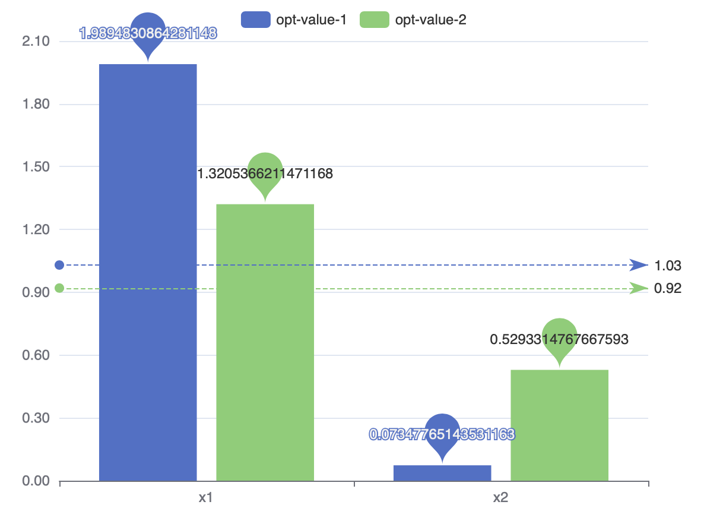

<br>

#### 2.2 Overall Parameter Importance of Constraints

This chart shows the importance of each parameter to the constraints. The higher the importance value is, the greater this parameter influences the constraint, whether in a positive way or an negative way.the objective, whether in a positive way or an negative way.

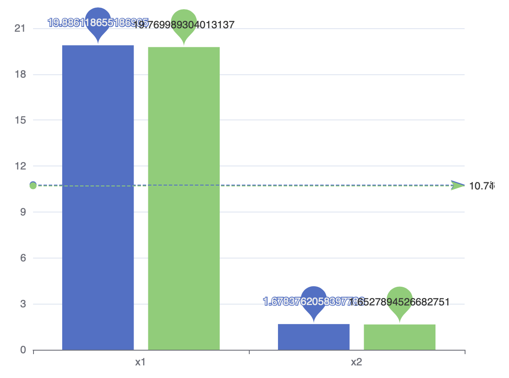

<br>

#### 2.3 Single Parameter Importance of Objectives

This chart shows how the objective depends on the given parameter. X-axis is the value of the parameter. Y-axis is the SHAP value of it. The absolute value of SHAP value represents the influence intensity. Positive value means a positive correlation. Negative value means a negative correlation. You can click the label on the top to switch parameter.

For **multi-objective problems**, You can select the objective from the drop-down box above the figure.

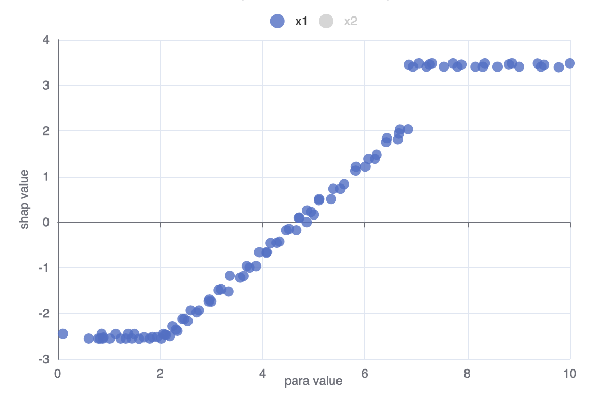

<br>

#### 2.4 Single Parameter Importance of Constraints

This chart shows how the constraints depends on the given parameter. X-axis is the value of the parameter. Y-axis is the SHAP value of it. The absolute value of SHAP value represents the influence intensity. Positive value means a positive correlation. Negative value means a negative correlation. You can click the label on the top to switch parameter.

You can select the constraint from the drop-down box above the figure if there are **more than one constraints**.

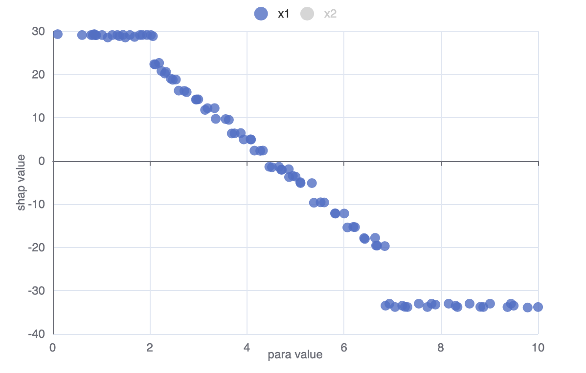

<br>
