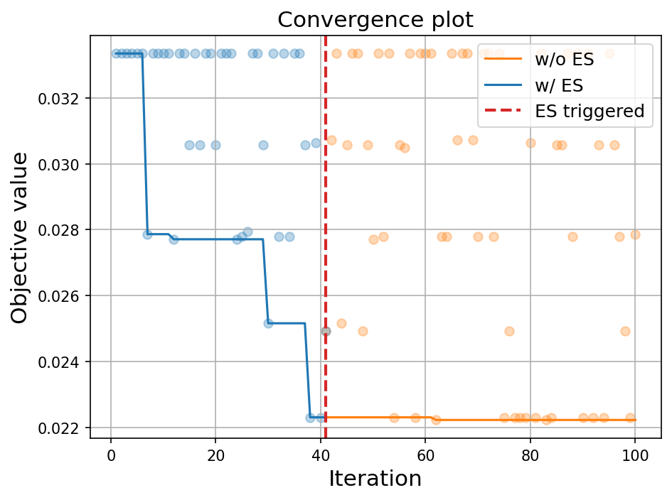
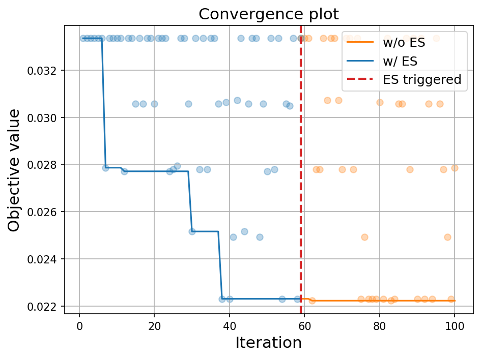

# 早停

在本教程中，我们将介绍如何在**OpenBox**中使用早停算法（Early Stopping, ES）。
在OpenBox中，早停算法通过监控优化过程的进展，并在满足特定条件时提前结束优化，以节省计算资源。
目前早停算法仅适用于单目标优化。

## 早停策略

OpenBox中的早停算法主要基于两个策略:

1. **无改进轮数（No Improvement Rounds）**:
   如果在一定数量的连续优化轮数内没有观察到任何改进，则触发早停。
2. **提升阈值（Improvement Threshold）**:
   如果期望提升（Expected Improvement，EI）小于特定阈值，则触发早停，说明当前情况下预期改进不足以被认为应该继续优化。
   注意，使用该策略时需要采集函数类型为EI (`acq_type='ei'`)。

## 使用方法

在创建`Optimizer`或`Advisor`类时，通过设置`early_stop=True`启用早停策略。
启用后，向`early_stop_kwargs`传入含参数的字典用于配置早停额外选项:

```python
opt = Optimizer(
    ...,
    early_stop=True,
    early_stop_kwargs=dict(
        min_iter=10,
        max_no_improvement_rounds=10,
        min_improvement_percentage=0.05,
    ),
)
```

参数含义如下:

- `min_iter` (int): 考虑早停之前的最小迭代次数。这确保了算法在考虑停止之前有足够的时间来探索配置空间。默认为10，范围应大于零。
- `max_no_improvement_rounds` (int): 允许的最大无改进轮数，用于无改进轮数早停策略。
  如果连续多轮没有改进，则触发早停。默认值为10。如设置为0，则代表不启用该策略。
- `min_improvement_percentage` (float): 最小期望提升百分比，用于提升阈值早停策略。
  如果期望提升小于`min_improvement_percentage * (当前最佳目标值 - 默认目标值)`，则触发早停。默认值为0.05。如设置为0，则代表不启用该策略。

## LightGBM调优示例

在以下样例中，我们使用OpenBox来调优LightGBM模型的参数，并启用早停策略。

```python
from sklearn.model_selection import train_test_split
from sklearn.datasets import load_digits
from openbox import get_config_space, get_objective_function
from openbox import Optimizer

# prepare your data
X, y = load_digits(return_X_y=True)
x_train, x_val, y_train, y_val = train_test_split(X, y, test_size=0.2, stratify=y, random_state=1)

# get config_space and objective_function
config_space = get_config_space('lightgbm')
objective_function = get_objective_function('lightgbm', x_train, x_val, y_train, y_val)

opt = Optimizer(
    objective_function,
    config_space,
    max_runs=100,
    surrogate_type='prf',
    task_id='tuning_lightgbm',
    early_stop=True,
    early_stop_kwargs=dict(
        min_iter=10,
        max_no_improvement_rounds=30,
        min_improvement_percentage=0.05,
    ),
    random_state=1,
)
history = opt.run()
print(history)
```

我们得到早停输出如下:

```
[Early Stop] EI less than the threshold! min_improvement_percentage=0.05, 
default_obj=0.03334620334620342, best_obj=0.022310167310167328, 
threshold=0.0005518018018018045, max_EI=[0.00051861]

Early stop triggered at iter 41!
```

说明在41轮时，由于候选配置的期望提升小于设定阈值，发生早停。

我们可以将不启用和启动早停的两个收敛曲线进行对比，发现在该早停配置下有效的提前结束了优化。



不同的早停配置会对停止轮数和效果产生影响，如设置`max_no_improvement_rounds=20`, `min_improvement_percentage=0.02`
（其余配置与上述相同），得到的早停输出如下:

```
[Early Stop] No improvement over 21 rounds!
Early stop triggered at iter 59!
```

说明在59轮时，发现目标函数未改进轮数超过阈值，发生早停。

与不启用早停的收敛曲线进行对比，结果如下:


