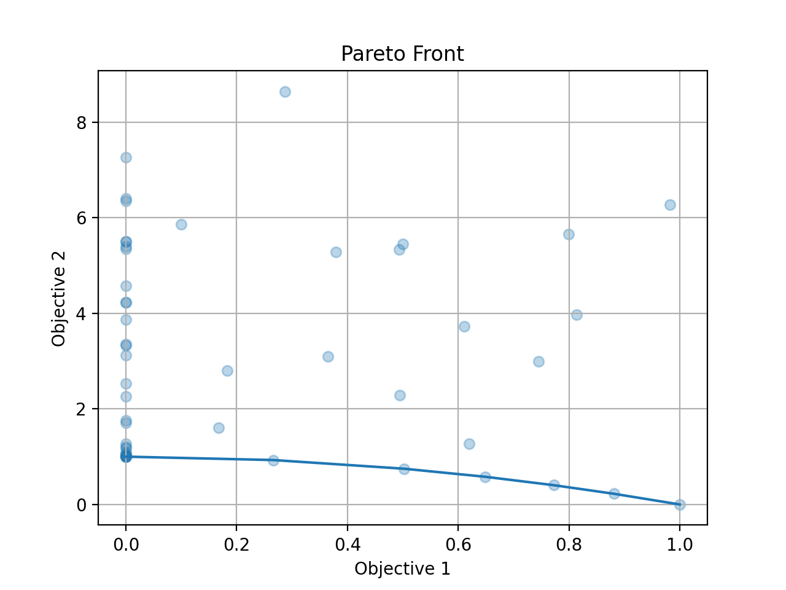
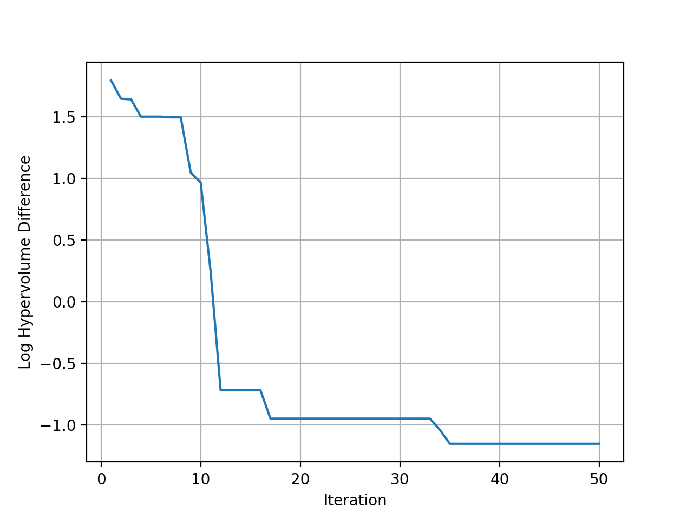

# 多目标黑盒优化

本教程介绍如何使用**OpenBox**解决多目标优化问题。

## 问题设置

在这个例子中，我们使用了具有三个输入维度的的多目标问题ZDT2。OpenBox内置了ZDT2函数，其搜索空间和目标函数被包装如下：

```python
from openbox.benchmark.objective_functions.synthetic import ZDT2

dim = 3
prob = ZDT2(dim=dim)
```

```python
import numpy as np
from openbox import space as sp
params = {'x%d' % i: (0, 1) for i in range(1, dim+1)}
space = sp.Space()
space.add_variables([sp.Real(k, *v) for k, v in params.items()])

def objective_function(config: sp.Configuration):
    X = np.array(list(config.get_dictionary().values()))
    f_0 = X[..., 0]
    g = 1 + 9 * X[..., 1:].mean(axis=-1)
    f_1 = g * (1 - (f_0 / g)**2)

    result = dict()
    result['objectives'] = np.stack([f_0, f_1], axis=-1)
    return result
```

在评估后，目标函数需要返回一个 `dict` **(推荐)**
其中的结果包含：

+ `'objectives'`：一个 **要被最小化目标值** 的 **列表/元组**。
在这个例子中，我们只有一个目标，所以这个元组只包含一个值。

+ `'constraints'`：一个含有 **约束值** 的 **列表/元组**。
如果问题没有约束，返回 `None` 或者不要把这个 key 放入字典。 非正的约束值 (**"<=0"**) 表示可行。


## 优化

```python
from openbox import Optimizer
opt = Optimizer(
    prob.evaluate,
    prob.config_space,
    num_objectives=prob.num_objectives,
    num_constraints=0,
    max_runs=50,
    surrogate_type='gp',                # try using 'auto'!
    acq_type='ehvi',                    # try using 'auto'!
    acq_optimizer_type='random_scipy',  # try using 'auto'!
    initial_runs=2*(dim+1),
    init_strategy='sobol',
    ref_point=prob.ref_point,
    task_id='mo',
    random_state=1,
    # Have a try on the new HTML visualization feature!
    # visualization='advanced',   # or 'basic'. For 'advanced', run 'pip install "openbox[extra]"' first
    # auto_open_html=True,        # open the visualization page in your browser automatically
)
opt.run()
```

这里我们创建一个 `Optimizer` 实例，并传入目标函数和搜索空间。
其它的参数是：

+ `num_objectives` 和 `num_constraints` 设置目标函数将返回多少目标和约束。在这个例子中，`num_objectives=2`。

+ `max_runs=50` 表示优化会进行50轮（优化目标函数50次）。

+ `surrogate_type='gp'` 对于数学问题，我们推荐用高斯过程 (`'gp'`) 做贝叶斯优化的替代模型。
对于实际问题，比如超参数优化（HPO）问题，我们推荐使用随机森林(`'prf'`)。
设置为 `'auto'` 来启用{ref}`自动化算法选择 <advanced_usage/auto_algorithm_selection:自动化算法选择>`。

+ `acq_type='ehvi'` 用 **EHVI(Expected Hypervolume Improvement)** 作为贝叶斯优化的acquisition function。
对于超过三个目标的问题，请使用**MESMO**(`'mesmo'`) 或 **USEMO**(`'usemo'`)。
设置为 `'auto'` 来启用{ref}`自动化算法选择 <advanced_usage/auto_algorithm_selection:自动化算法选择>`。

+ `acq_optimizer_type='random_scipy'`. 对于数学问题，我们推荐用 `'random_scipy'` 作为 acquisition function 的优化器。
  对于实际问题，比如超参数优化（HPO）问题，我们推荐使用 `'local_random'` 。
设置为 `'auto'` 来启用{ref}`自动化算法选择 <advanced_usage/auto_algorithm_selection:自动化算法选择>`。

+ `initial_runs` 设置在优化循环之前，`init_strategy`推荐使用的配置数量。

+ `init_strategy='sobol'` 设置建议初始配置的策略。

+ `ref_point` 指定参考点，它是用于计算超体积的目标的上限。
  如果使用EHVI方法，则必须提供参考点。
  在实践中，可以1）使用领域知识将参考点设置为略差于目标值的上界，其中上界是每个目标感兴趣的最大可接受值，或者2）使用动态的参考点选择策略。

+ `task_id` 用来识别优化过程。

+ `visualization`: `'none'`， `'basic'` 或 `'advanced'`。
详见 {ref}`可视化网页 <visualization/visualization:可视化网页>`。

+ `auto_open_html`: 是否自动在浏览器中打开可视化网页。
详见 {ref}`可视化网页 <visualization/visualization:可视化网页>`。

然后，调用 `opt.run()` 启动优化过程。

## 可视化

由于我们同时优化了这两个目标，我们得到了一个帕累托前沿(pareto front)作为结果。
调用 `opt.get_history().plot_pareto_front()` 来绘制帕累托前沿。
请注意，`plot_pareto_front`只在目标数为2或3时可用。

```python
import matplotlib.pyplot as plt

history = opt.get_history()
# plot pareto front
if history.num_objectives in [2, 3]:
    history.plot_pareto_front()  # support 2 or 3 objectives
    plt.show()
```



然后绘制优化过程中与理想帕累托前沿相比的hypervolume差。

```python
# plot hypervolume
history.plot_hypervolumes(optimal_hypervolume=prob.max_hv, logy=True)
plt.show()
```



<font color=#FF0000>(新功能!)</font>
调用 `history.visualize_html()` 来显示可视化网页。
对于 `show_importance` 和 `verify_surrogate`，需要先运行 `pip install "openbox[extra]"`。
详细说明请参考 {ref}`可视化网页 <visualization/visualization:可视化网页>`。

```python
history.visualize_html(open_html=True, show_importance=True,
                       verify_surrogate=True, optimizer=opt)
```


